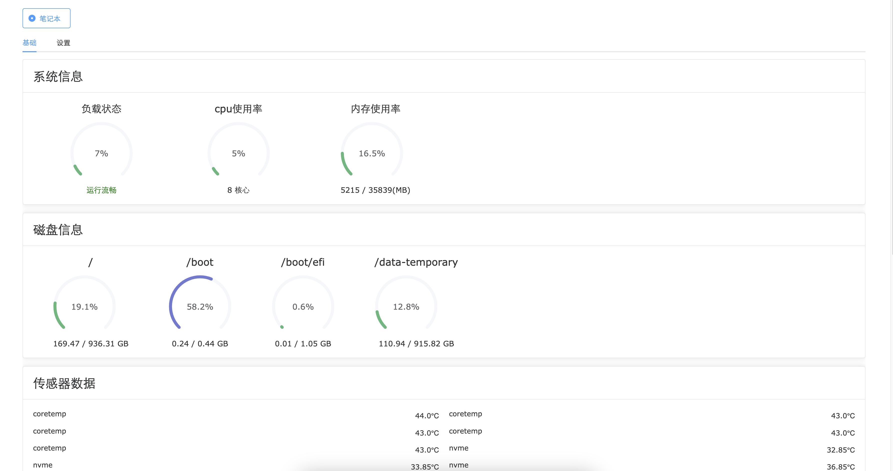

# OpenMonitor 开源监控工具
使用python vue编写的linux服务器监控工具，客户端支持多服务器地址配置、切换。服务端只提供数据的上报
## 安装指南
### 源代码本地运行
1. 克隆项目到本地：
```shell
git clone https://github.com/EightDoor/OpenMonitor.git
```
2. vue 前端项目
- 进入vue-app项目 `cd vue-app`
- 安装依赖 `pnpm install`
- 运行 `npm run dev`
3. python 后端项目
- 进入py项目 `cd py`
- 安装依赖
```shell
# 使用uv进行包管理
# uv官网地址 https://docs.astral.sh/uv/
pip install uv 
# 安装依赖
uv pip install -r pyproject.toml
# 启动
uv run main.py
```
## 使用
- 前端
    - 在`vue-app`中，运行`npm run build`打包资源，把`dist`下资源部署到`nginx`或者`pm2`方式启动
    - 在“设置”中添加地址描述、后端部署的服务URL地址，配置的信息保存在前端浏览器当中
- 后端
    - 方式1：服务器安装python环境，在`py`文件夹中，通过`manager.sh`脚本启动，把程序作为服务运行
    - 方式2：打包单文件，在`py`文件夹中，运行`python build.py`,把`dist`下单文件部署到服务器上启动
    - 后端启动端口：8500
## 功能列表
- 系统信息
    - 负载状态
    - cpu使用率
    - 内存使用率
- 磁盘信息
- 传感器数据
    - cpu温度、硬盘温度等
- 磁盘状态SMART
- 磁盘IO
- 流量
- 设置
    - 配置多项服务器地址，可以切换多个服务地址

## 截图
- 
- 
- 
## 许可证
- [MIT](./LICENSE)